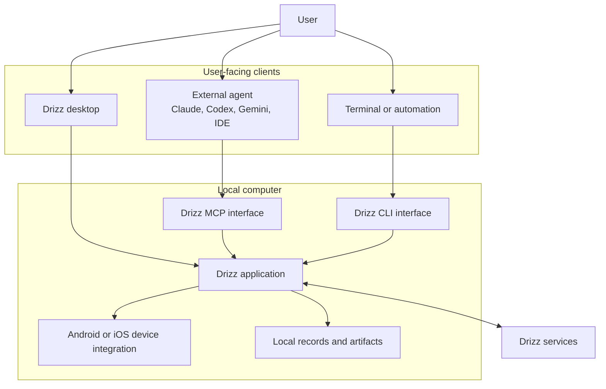
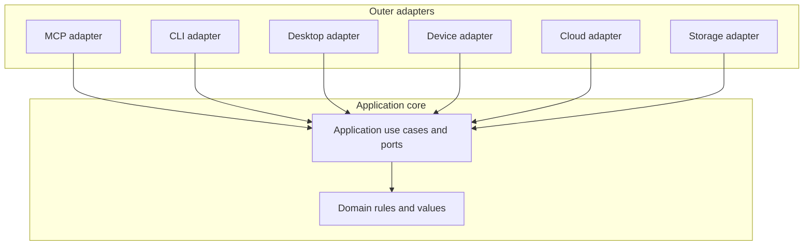
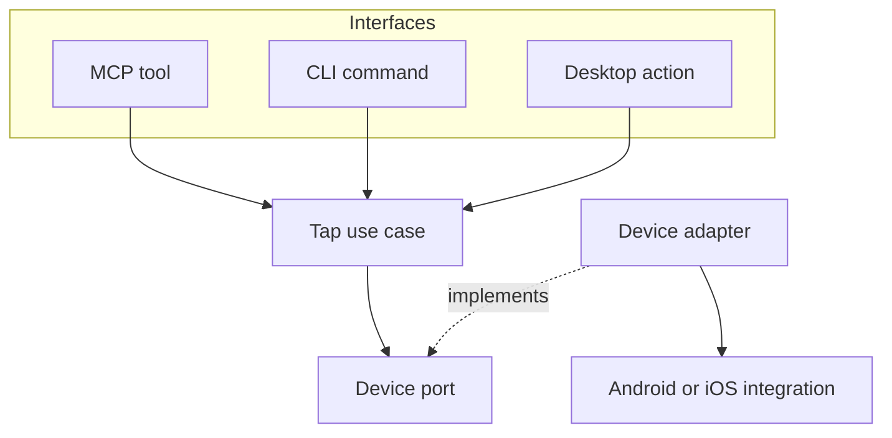

# Platform Architecture

Status: Approved baseline

## 1. Purpose

Drizz Platform provides one local foundation through which MCP clients, the command line, and the Drizz desktop application can use approved Drizz capabilities.

External agents such as Claude, Codex, and Gemini interpret the user's goal and plan the work. Drizz does not add another planner. Drizz authenticates the user, executes approved operations, interacts with local devices, records outcomes, and synchronizes required data with Drizz services.

## 2. Known product constraints

- Device observation and actions should run locally when the device is local.
- MCP and CLI must reuse the same product behavior.
- The desktop application must be able to use the same behavior without a second implementation.
- Drizz services remain authoritative for cloud data and organization access.
- Local work must be recorded and synchronized without making every device action wait for a cloud round trip.
- Primary agent applications must use their official MCP, plugin, hook, and structured-event surfaces without requiring a developer SDK or Python runtime.
- Public tool names and schemas are not yet approved.

## 3. System context

The following diagram shows runtime communication. Its arrows mean “invokes” or “exchanges data with”; they do not represent source-code dependencies.

The desktop-to-host protocol is intentionally unspecified until the current desktop application is inspected and the lifecycle requirements are known.

## 4. Local and cloud responsibility

### Local responsibility

- start the requested interface;
- obtain and protect the user's authenticated session;
- validate local requests;
- interact with local devices;
- run approved local deterministic behavior;
- record local execution facts and artifacts;
- retry and resume synchronization;
- bound disk, memory, process, and concurrency usage.

### Cloud responsibility

- validate cloud credentials;
- enforce organization membership and resource authorization;
- own durable cloud resources and shared history;
- accept synchronized records and artifacts idempotently;
- expose cloud-backed product operations.

Local cached identity can support explicitly approved offline behavior. It never grants access to cloud data and never replaces cloud authorization.

## 5. Architectural shape

The approved shape is a modular monolith with inward dependencies. A single installable application is appropriate for local execution, while module and port boundaries preserve the option to extract a capability later.

The following diagram shows source-code dependency direction. Every arrow means “depends on.”

The domain does not import adapters, SDKs, databases, transports, or cloud clients. Application code owns the interfaces that outer adapters implement.

## 6. Capability reuse

A product capability is an application use case. MCP tools, CLI commands, and desktop actions are interface-specific mappings to that use case.

For example, a future approved device tap operation would be implemented once:

This diagram deliberately separates the use case from the interface name. Inputs, outputs, authorization, recording, and failure behavior must be agreed before the operation becomes public.

## 7. Process model

### MCP

For a local standard-input/output integration, the MCP client starts `drizz mcp` when it needs the configured server. The client owns that child process lifecycle. Drizz writes protocol messages to standard output and diagnostics to standard error.

The local stdio process reuses the installed user's Drizz session through the shared identity service. It does not perform the HTTP MCP OAuth flow and does not expose credentials to the MCP client or model.

### CLI

`drizz <command>` starts a normal command-line process, invokes the same application use case, returns a stable exit result, and exits.

### Desktop

The desktop application should use the same released Drizz implementation. The choice between a supervised child process and another local boundary remains open until the desktop source and multi-client lifecycle are audited. The desktop must not reimplement capabilities.

### Remote interfaces

A remote HTTP MCP deployment is a separate product mode. It follows the MCP OAuth 2.1 authorization specification and cannot directly reach a device on the user's computer. A future local-device relay requires its own approved design.

## 8. Agent integration and capture

Claude, Codex, and other supported external agents continue to own the model conversation and planning loop. Drizz combines two observable sources:

- host events supplied through official hooks, plugins, transcripts, or structured event streams; and
- authoritative capability events recorded inside the shared Drizz application core.

Host-specific adapters validate and normalize their external formats into one Drizz-owned capture contract. MCP requests alone provide tool execution context, not the complete host conversation. A surface without approved lifecycle events is supported with explicitly reduced capture fidelity.

OpenInference is not required for external agent CLI or desktop integrations and is not part of the first-release runtime. A future SDK-based integration may accept or export OpenInference only through a replaceable outer adapter. The canonical product record remains the Drizz execution record.

The complete contract, privacy scope, supported surfaces, implementation order, and verification matrix are defined in [Agent Integration and Execution Capture](capture.md).

## 9. Candidate product modules

These are candidate ownership boundaries, not approved public tools or a required folder tree.

| Module | Responsibility |
| --- | --- |
| Identity | Local sign-in lifecycle and authenticated context |
| Device | Device discovery, connection, observation, and actions |
| Execution | Operation lifecycle, cancellation, and outcome |
| Capture | Typed agent and capability event normalization, fidelity, and correlation |
| Integration | Supported agent detection, plugin lifecycle, and compatibility |
| Artifact | Local artifact identity, integrity, and retention state |
| Sync | Durable transfer, retry, resume, and reconciliation |
| Authoring | Approved deterministic authoring behavior |

Test plan, debugging, application, and report modules should be designed when their product requirements and existing cloud contracts are inspected.

## 10. Local records and synchronization

The requirements are:

- an operation and its synchronization intent cannot silently diverge;
- retries must not create duplicate cloud effects;
- restart, sleep, loss of network, and process termination must be recoverable;
- credentials must not be stored with normal execution data;
- local artifacts must have bounded retention and safe cleanup;
- in-use or unsynchronized evidence must not be deleted.

SQLite metadata plus filesystem artifacts is the accepted architectural direction. Its driver, schema, locking, crash, migration, multi-process, cleanup, and supported-operating-system behavior must be proven before the implementation is accepted.

The final Stage 3 authentication plan defines a separate identity coordination database for non-secret session epochs, credential pointers, fenced publication, and durable cleanup. Its implementation remains gated by the required dependency and platform proofs. It does not decide the later execution, synchronization, or artifact persistence schema.

## 11. Security boundaries

- Native sign-in uses Authorization Code with PKCE in the system browser.
- Device Authorization is the explicit fallback for headless terminals.
- Local MCP reuses the installed session without receiving its credentials.
- Agent plugins and hooks contain no Drizz credential and cannot change the user's existing agent authentication.
- CI uses workload identity federation where available and an isolated machine client otherwise; it never uses a human refresh token.
- Credentials belong in the operating-system credential store.
- The cloud rechecks authorization for every cloud resource.
- Interface input cannot supply trusted user or organization identity.
- Device data, screenshots, page structure, logs, and artifacts are potentially sensitive.
- Subprocesses require explicit executable, arguments, environment, deadline, output, and shutdown limits.
- Local files must remain within approved Drizz-owned locations unless the user explicitly grants another path.

The complete contract is defined in [Authentication and Authorization](authentication.md). Its Stage 3 delivery is defined in the [Authentication Implementation Plan](plans/authentication.md).

## 12. Open decisions

- approved first capability set and public vocabulary;
- desktop process and update lifecycle;
- device integration boundary for Android and iOS;
- which deterministic authoring behavior may be distributed locally;
- execution, synchronization, and artifact SQLite schema, concurrency, migration, and cleanup design; identity coordination is owned separately by the Stage 3 authentication plan;
- synchronization contract with existing Drizz services;
- supported operating systems and installation channels;
- exact supported versions and capture capability matrix for each agent application surface;
- when a remote HTTP MCP endpoint and local-device relay become product requirements.

No open decision in this section should be treated as an implementation choice.
