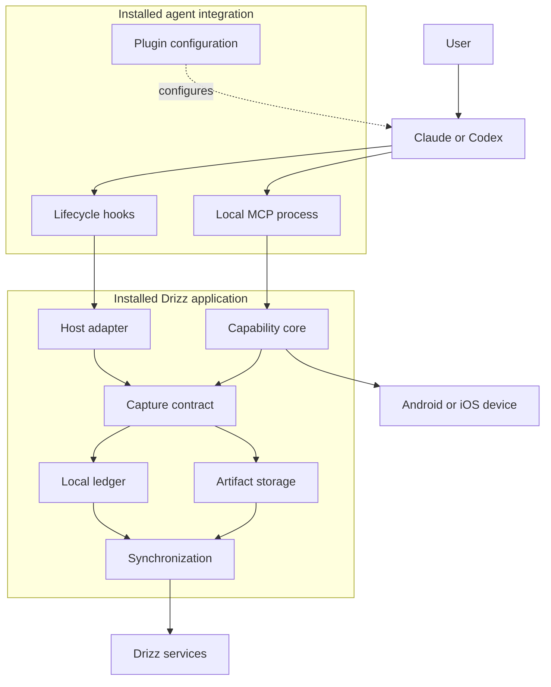

# Agent Integration and Execution Capture

Status: Approved architecture

## 1. Purpose

This document defines how Drizz integrates with external agent applications and captures the information required to understand an execution. It covers the primary product journey in which a person uses Claude, Codex, or another supported agent application while Drizz executes local capabilities.

The capture exists to support Drizz execution history, debugging, evaluation, and future datasets. It does not move planning into Drizz and does not add a reinforcement-learning system to the local application.

## 2. Decision

The primary integration uses each supported agent application's official extension surfaces:

- MCP exposes Drizz capabilities to the agent;
- plugins package the supported integration for installation;
- lifecycle hooks and structured host events provide agent-side execution context;
- the installed Go application validates, normalizes, records, and synchronizes the resulting Drizz execution.

OpenInference is not required for Claude, Codex, Gemini, or another external agent application. It is not part of the first-release runtime or delivery sequence. A future custom application built with a model or agent SDK may send OpenInference or OpenTelemetry data through a separate adapter. That adapter must remain behind a Drizz-owned interface and cannot define the canonical execution model.

`coding-harness-tracing`, Neatlogs, and similar projects are research evidence. They are not installed on customer machines, are not runtime dependencies, and do not determine Drizz contracts or storage.

## 3. Terms

| Term | Meaning in Drizz |
| --- | --- |
| Agent application | Claude Code, Codex, Gemini CLI, or another application that owns the model conversation and planning loop |
| MCP | The standard interface through which an agent discovers and invokes Drizz capabilities |
| Hook | A host-owned lifecycle callback that invokes Drizz with a structured event |
| Plugin | An installable package that can register MCP configuration, hooks, and supporting metadata with an agent application |
| Host adapter | A Drizz adapter that validates one agent application's event format and converts it to the Drizz capture contract |
| Capability record | The authoritative Drizz record of a capability request, local execution, result, failure, and evidence |
| Agent context | Host-provided prompt, response, tool, session, usage, or exposed reasoning information associated with a Drizz execution |
| Operational telemetry | Privacy-safe logs, metrics, and traces used to operate the application; it is not the product execution record |

## 4. Supported surfaces

The first supported integrations are Claude Code and Codex. Support is declared per product surface and tested version; a brand name alone is not a compatibility claim.

| Surface | Drizz capabilities | Agent context | Integration |
| --- | --- | --- | --- |
| Claude Code CLI and supported IDE surfaces | Local MCP | Official hooks and supported transcript data | Claude plugin |
| Codex CLI and supported desktop surfaces | Local MCP | Official hooks and structured events available on that surface | Codex plugin |
| Claude Desktop | Local MCP | MCP calls and results only unless the product exposes an approved lifecycle interface | Desktop Extension |
| Generic MCP client | Local MCP | MCP calls and results only | Standard MCP configuration |

The integration publishes a tested capability matrix for each supported version. Missing host information is recorded as unavailable. Drizz must not infer that a hook exists across all applications or that CLI and desktop variants expose the same events.

## 5. Product journey

The intended user journey is:

1. The user installs the signed Drizz application.
2. The user signs in through the approved native authentication flow.
3. Drizz detects supported installed agent applications.
4. The user chooses a supported agent and reviews the requested capture scope.
5. Drizz installs or updates the agent's supported plugin and configuration.
6. The agent shows its native review or trust step where required.
7. The user continues working in the agent application normally.

The user does not install Python, create a virtual environment, edit JSON, copy a bearer token, start a background terminal command, or configure an observability backend.

## 6. Runtime flow



The agent application starts the local standard-input/output MCP process when it needs Drizz. It invokes the configured hook command when a supported lifecycle event occurs. Both commands enter the same installed Go application and reuse the same application-owned identity, capture, persistence, and synchronization boundaries.

## 7. Plugin and hook contract

An agent plugin contains configuration and metadata. It does not contain Drizz business behavior. The integration manager resolves the installed signed Drizz executable and writes the exact executable path and argument list required by the host. It must merge supported configuration without overwriting unrelated user settings.

The conceptual commands are:

```text
drizz mcp
drizz hook claude
drizz hook codex
```

These commands describe nested responsibilities and do not approve additional public product capabilities.

A hook receives the host's JSON through standard input. It writes only the host-required machine response to standard output and sends privacy-safe diagnostics to standard error. Hook payloads, transcript locations, tool inputs, and tool results are untrusted external data. The host adapter bounds, validates, and converts them immediately to typed Drizz values.

Agent-side capture is observational. Its failure must not silently change an agent decision or approve an action. A missing or malformed host event produces an incomplete capture classification and privacy-safe diagnostics. By contrast, an approved Drizz capability that requires a durable record must establish that record before performing its irreversible side effect.

## 8. Canonical execution record

The Drizz execution record is the product source of truth. It is an ordered, durable record that can represent:

- session and turn lifecycle;
- user input supplied by the host under the approved capture policy;
- provider-exposed model output and reasoning representation;
- tool requests and host-observed tool results;
- Drizz capability requests, validated inputs, execution, results, and failures;
- device observations and actions;
- artifact identity, integrity, classification, and retention state;
- cancellation, retry, recovery, and synchronization state;
- final outcome and later approved evaluation data.

The capture contract distinguishes the origin and fidelity of information. A value may be exact host data, a provider-produced summary, an inferred relationship, unavailable, or redacted. Inferred data must never be presented as exact.

External provider objects, hook payloads, OpenTelemetry spans, and OpenInference attributes do not cross into the application or domain. Each adapter converts supported data to Drizz-owned typed contracts. Unsupported or unclassified fields are not persisted as an unrestricted payload.

## 9. Reasoning boundary

Drizz records only reasoning-related information that the supported host or provider explicitly exposes, such as a reasoning summary, thinking block, signature, or token count. Every value retains its source and representation.

Drizz does not claim to capture private chain-of-thought, reconstruct hidden reasoning, or obtain information that never crosses an observable host boundary. A tool choice, sequence, retry, or result may be useful execution evidence, but it is not relabeled as model reasoning.

## 10. Correlation

Host hooks and MCP observe different parts of the same execution. The capture layer correlates them using every supported stable identifier, including host session, turn, tool-call, MCP connection, execution, and capability-call identity.

When a host does not carry a common stable identifier across its hook and MCP boundaries, correlation may also consider ordered events, normalized tool input, process relationship, and bounded time. Such a relationship is explicitly marked inferred. Each supported host adapter requires fixtures and real-client tests for exact, inferred, missing, duplicate, delayed, and out-of-order events.

## 11. Scope and privacy

Installing an integration does not authorize Drizz to upload every conversation from the agent application.

Before enablement, Drizz presents the capture categories, obtains user consent, and applies any current organization policy. The adapter keeps only a bounded local pending window needed to associate the current request with a possible Drizz capability call. A Drizz capability call activates the corresponding execution. Pending data for unrelated work expires locally and is never synchronized.

Prompt, response, tool content, screenshots, hierarchy data, files, and device logs are product data, not operational telemetry. Each category requires an approved purpose, classification, byte limit, retention, visibility, redaction, and upload policy. Authentication credentials never enter plugin configuration, hook payloads, MCP messages, model context, execution records, artifacts, or operational telemetry.

## 12. Authentication and authorization

Agent plugins and hooks contain no Drizz credential. Local MCP and hook commands reuse the installed user's application-owned session. Synchronization obtains credentials only through the identity boundary and Drizz Cloud rechecks current organization and resource authorization.

Connecting Drizz does not replace or modify the user's Claude, Codex, Gemini, ChatGPT, or IDE authentication. The complete Drizz contract is defined in [Authentication and Authorization](authentication.md).

## 13. OpenInference and SDK integrations

OpenInference solves a different future journey: an application developer who controls an agent or model SDK may install an instrumentor and export standard AI traces. It does not attach to an arbitrary external CLI or desktop application and does not create access to hidden model state.

OpenInference is therefore explicitly deferred. If a product requirement later approves it, Drizz may add:

- an inbound adapter that validates supported OpenInference or OpenTelemetry data and converts it to the Drizz capture contract; or
- an outbound adapter that maps approved Drizz events to standard spans for an external observability system.

Either direction requires its own dependency review, security and privacy review, compatibility matrix, failure behavior, and approval. The adapter is replaceable and cannot become the persistence schema, synchronization contract, or canonical execution model.

## 14. Implementation order

Implementation follows the [Delivery Roadmap](roadmap.md):

1. complete authentication and authorization;
2. prove the first local Android journey;
3. approve the capture contract, persistence behavior, privacy policy, and synchronization contract;
4. instrument the shared capability core so MCP and CLI produce the same authoritative execution record;
5. implement and verify the Claude plugin and host adapter;
6. implement and verify the Codex plugin and host adapter;
7. release only the tested client and operating-system combinations;
8. add other agent applications or SDK trace ingestion only through separately approved vertical outcomes.

No coding agent may add OpenInference, a Python sidecar, an agent integration, or a new capture field merely because it appears in a research project. The requirement, owner, classification, contract, and verification must first be approved in the owning delivery stage.

## 15. Verification

Each supported integration must prove:

- install, detection, enablement, native trust, update, disablement, and removal;
- MCP startup and shutdown without manual user commands;
- hook input validation, stdout isolation, timeout, cancellation, and failure;
- exact capability execution records through MCP and CLI;
- supported prompt, response, tool, usage, and exposed-reasoning capture;
- honest incomplete capture when a surface omits an event;
- session and tool correlation across success, failure, retry, and concurrency;
- no synchronization of unrelated agent sessions;
- no credential exposure to the host, model, MCP, hook, record, or telemetry;
- restart, network loss, duplicate delivery, storage pressure, and cleanup;
- compatibility against real supported agent versions, not only mocks.

The capability matrix and real-client tests are release evidence. A plugin that installs successfully but does not prove the supported execution journey is not complete.
