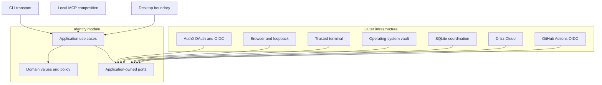
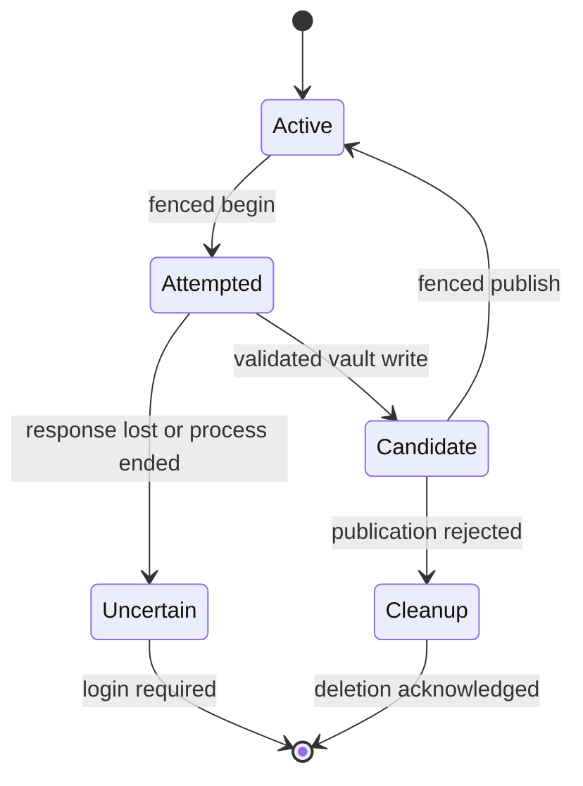

# Stage 3 Authentication Implementation Plan

Status: Final

## 1. Purpose

This is the binding implementation plan for Stage 3 of the
[Delivery Roadmap](../roadmap.md). The approved product and security behavior
remains in [Authentication and Authorization](../authentication.md), and the
architectural decision remains in
[ADR 0006](../decisions/0006-authentication.md).

Work starts with Gate 1. A later slice must stop when Gate 1 has not resolved a
fact it depends on. A coding agent must reread the repository standards and copy
the slice inventory into its issue or pull request before editing.

## 2. Outcome

Stage 3 delivers one identity module reused by CLI, local MCP, and the future
desktop boundary. It supports:

- system-browser Authorization Code with PKCE for normal user sign-in;
- explicit Device Authorization for a user-present headless terminal;
- renewable credentials in the operating-system vault only;
- process-local access tokens;
- safe concurrent use by separate CLI and MCP processes;
- current organization resolution and cloud authorization through Drizz Cloud;
- GitHub Actions OIDC federation for the first CI workload;
- deterministic logout, revocation, expiry, cancellation, restart, and
  recovery; and
- unchanged login behavior for existing Drizz products.

Stage 3 does not add a public MCP tool. Stage 6 proves real authenticated MCP
capability invocation. Stage 3 proves only that MCP composition can consume the
same identity application without receiving a credential.

## 3. Scope

### Included

- isolated Auth0 Platform native application and Platform API configuration;
- browser and device user journeys;
- supported macOS, Windows, and Linux credential vaults;
- typed identity, session, organization, credential, and failure contracts;
- SQLite coordination for leases, fenced publication, session invalidation,
  recovery, and durable credential cleanup;
- `drizz login`, `drizz login --device`, and `drizz logout`;
- Drizz Cloud organization resolution and authorization proof;
- GitHub Actions workload federation;
- privacy-safe diagnostics, metrics, traces, and release evidence; and
- existing-product Auth0 regression tests.

### Excluded

- replacing or changing existing web, playground, desktop, backend, or load
  balancer login flows;
- remote HTTP MCP authorization;
- Dynamic Client Registration;
- a hosted-agent relay;
- a local authentication daemon;
- organization selection or administration;
- a token-print, token-import, or authentication MCP tool;
- storing human access or refresh tokens in files, SQLite, environment
  variables, arguments, MCP messages, model context, logs, traces, crash data,
  or execution records; and
- custom OAuth, OIDC, JWT, PKCE, encryption, or vault implementations.

## 4. Binding decisions

| Concern | Decision |
| --- | --- |
| Identity provider | Auth0 through an isolated Platform native application and Platform API |
| Default user flow | Authorization Code with PKCE `S256` in the system browser |
| Headless user flow | Explicit Device Authorization through `drizz login --device` |
| Local MCP | Reuse the installed session; never run HTTP MCP OAuth over stdio |
| Renewable credential | Immutable versioned entries in the operating-system vault |
| Access credential | Process memory only |
| Coordination | Non-secret SQLite state accepted by ADR 0004 |
| Organization authority | Current Drizz Cloud state, never local claims or user input |
| CI | GitHub Actions OIDC federation; no human credential |
| Machine fallback | Excluded unless federation fails an approved journey and a separate review accepts it |
| Remote MCP | Future plan when a remote endpoint enters the roadmap |

The previously created Auth0 application named Drizz MCP is evidence, not a
configuration template. Gate 1 must inspect it and propose the final additive
Platform resources through the existing infrastructure owner.

## 5. Architecture



Dependencies point inward. Domain contains deterministic identity meaning only.
Application owns use cases, state transitions, cancellation, and narrow ports.
Infrastructure implements provider, network, process, persistence, and
credential ports. CLI validates and maps external input. Host owns composition
and shutdown only.

### Planned ownership

```text
internal/identity/
  domain/
    failure/
  application/
    coordination/
    credential/
    device/
    grant/
    login/
    logout/
    organization/
    session/
    workload/
  infrastructure/
    auth0/
    browser/
    cloud/
    github/
    sqlite/
    terminal/
    vault/
internal/transport/cli/
internal/host/
tests/identity/
tests/process/
```

Every directory and file uses one precise word. Every source file owns one
primary concept. Infrastructure types never cross into application or domain.
No generic service, manager, helper, types, common, or utility package is
allowed.

## 6. Contracts

### Trusted context

The application returns validated subject identity, session status, expiry,
authentication method, stable Drizz session identity, and current organization
only when the operation requires and successfully resolves it. It never returns
an access token, refresh token, authorization code, device code, provider
response, HTTP object, or Auth0 SDK type.

### Credential contracts

`credential.Record` contains issuer, native-client identity, provider subject,
Drizz session identity, authentication method, renewable credential bytes,
issue and expiry facts, revision, and schema version. It contains no profile,
role, organization, access decision, or arbitrary provider payload.

`grant.Credential` is the confined short-lived Platform access credential. Only
the session application and approved Auth0 and cloud infrastructure may import
it. Architecture tests prohibit it in CLI, MCP, desktop, capabilities,
telemetry, and general cloud clients.

### Use cases

| Package | Public operation | Owned ports |
| --- | --- | --- |
| `login` | `Flow.Run(context.Context, Input) Result` | `Authorization`, `Browser`, `Publication`, `Clock`, `Random` |
| `device` | `Flow.Run(context.Context, Input) Result` | `Authorization`, `Terminal`, `Publication`, `Clock` |
| `session` | `Flow.Current(context.Context, Input) Result` | `Vault`, `Refresh`, `Publication`, `Epoch`, `Clock` |
| `logout` | `Flow.Run(context.Context, Input) Result` | `Vault`, `Revocation`, `Publication`, `Clock` |
| `organization` | `Flow.Resolve(context.Context, Input) Result` | `Resolver` |
| `workload` | `Flow.Exchange(context.Context, Input) Result` | `Assertion`, `Exchange`, `Replay`, `Clock` |

All state is private and constructed through validated typed input. Every
multi-value call uses a keyed input struct. Context is the first argument. No
raw map, `any`, provider SDK type, database row, or transport model crosses a
layer.

### Failure contract

`failure.Value` contains a stable code, category, retryability, recommended
action, allowlisted safe detail, correlation identity, and optional retry time.
Raw provider causes remain private and are never rendered, logged, traced, or
reported to Sentry. Unexpected identity failures become a code-only result
before reaching the host.

The stable values are:

- `AUTHENTICATION_REQUIRED`
- `AUTHENTICATION_CANCELLED`
- `AUTHORIZATION_FORBIDDEN`
- `AUTHENTICATION_UNAVAILABLE`
- `AUTHENTICATION_REJECTED`
- `ACCOUNT_CONFLICT`
- `SECURE_STORAGE_UNAVAILABLE`
- `LOGOUT_PARTIAL`
- `IDENTITY_FAILED`

Released values are additive. A value is never renamed or reused for a
different meaning.

## 7. CLI behavior

| Command | Behavior |
| --- | --- |
| `drizz login` | Starts browser PKCE; no positional arguments |
| `drizz login --device` | Starts Device Authorization; no browser fallback |
| `drizz logout` | Removes local access idempotently, then attempts bounded revocation |

Successful login prints `Signed in to Drizz.` to standard output. Successful
logout prints `Signed out of Drizz.` to standard output. Device instructions go
only to a trusted controlling terminal, never stdout, stderr, MCP, or model
context. A missing trusted terminal fails safely.

Invalid login syntax prints only `Usage: drizz login [--device]`. Invalid
logout syntax prints only `Usage: drizz logout`. Unknown input is never echoed.
Stage 3 adds no JSON mode. Exit status is `0` for a completed local result and
`1` for usage, cancellation, partial logout, or failure, preserving the current
process contract.

| Failure | Fixed standard-error message |
| --- | --- |
| `AUTHENTICATION_REQUIRED` | `Sign in to Drizz by running drizz login.` |
| `AUTHENTICATION_CANCELLED` | `Drizz sign-in was cancelled.` |
| `AUTHORIZATION_FORBIDDEN` | `Drizz access is not allowed.` |
| `AUTHENTICATION_UNAVAILABLE` | `Drizz authentication is temporarily unavailable. Try again.` |
| `AUTHENTICATION_REJECTED` | `Drizz could not verify the sign-in. Try again.` |
| `ACCOUNT_CONFLICT` | `Another Drizz account is signed in. Run drizz logout first.` |
| `SECURE_STORAGE_UNAVAILABLE` | `Secure credential storage is unavailable on this computer.` |
| `LOGOUT_PARTIAL` | `Signed out locally, but remote revocation could not be confirmed.` |
| `IDENTITY_FAILED` | `Drizz could not complete the authentication request.` |

## 8. Lifecycle and persistence

### Browser login

1. Create cryptographic state, nonce, and PKCE verifier.
2. Bind a loopback listener to `127.0.0.1` only.
3. Open the system browser.
4. Validate callback method, path, size, state, issuer, audience, signature,
   nonce, expiry, and schema.
5. Exchange and validate the code.
6. Write a uniquely named immutable vault candidate.
7. Publish only when the starting session epoch still matches.
8. Advance the epoch and remove any superseded credential through durable
   cleanup.

Concurrent login attempts cannot switch accounts by last writer. The first
valid compare-and-swap wins. A different active subject returns
`ACCOUNT_CONFLICT`; the user must log out before switching accounts.

The callback sends at most 1 KiB of fixed Drizz-authored HTML with UTF-8 HTML,
`Cache-Control: no-store`, `Content-Security-Policy: default-src 'none'`,
`Referrer-Policy: no-referrer`, and `X-Content-Type-Options: nosniff`. It reflects
no provider or query value. The exact callback path consumes one request. A bad
method, state, or schema returns a fixed rejection and closes the listener.
Other paths receive a fixed 404; three such requests close the listener.

### Device login

Device login uses provider interval, `slow_down`, expiry, and cancellation. The
verification URI and user code are validated, bounded, and written once to the
controlling terminal. It uses the same epoch and fenced publication policy as
browser login.

### Refresh publication

Vault credential versions are immutable. SQLite contains only non-secret active
pointer, epoch, lease, attempt, fencing, and cleanup metadata.



Before refresh, SQLite irreversibly marks the active revision `ATTEMPTED` in a
short transaction. No second process may exchange that revision, even after
lease expiry. Auth0 I/O and vault I/O occur outside mutexes, file locks, and
SQLite transactions. A validated response is written to a unique vault key,
then one fenced compare-and-swap transaction publishes it. A stale process may
create an orphan candidate but cannot change the active pointer.

If a process ends after Auth0 may have rotated the token but before a candidate
reaches the vault, the revision becomes `UNCERTAIN` and requires login. Drizz
never retries an uncertain refresh token and never depends on Auth0 overlap for
correctness.

### Logout and cleanup

Logout atomically clears the active pointer, advances the epoch, and enqueues
all active and candidate vault keys for cleanup. Other processes check the epoch
before using cached access. Physical deletion is idempotent. Remote revocation
runs afterward with the in-memory credential and no held lease or transaction.

A cleanup record stores only vault key, reason, state, attempt count, next retry,
retry deadline, and creation time. Five bounded retries are allowed. Exhaustion
moves the record to `BLOCKED`; it is never silently discarded. Startup and each
credential mutation reconcile at most four records. Sixteen retained records
block further credential creation. A missing vault key counts as successful
deletion, making a crash between deletion and acknowledgement recoverable.

The identity coordination database is versioned, permission-restricted,
size-bounded, and stored under the resolved Drizz-owned data root. It contains
no token, provider subject, profile, organization, or provider payload. All
opens, migrations, checkpoints, and cleanup resist traversal, symlink
substitution, and cross-user access. Corruption fails closed.

### Offline behavior

| Condition | Result |
| --- | --- |
| Valid process token; cloud unavailable | Local identity remains valid until expiry; organization and cloud operations return `AUTHENTICATION_UNAVAILABLE` |
| Expired token; Auth0 unavailable | Return `AUTHENTICATION_UNAVAILABLE`; retain the vault credential for a later explicit attempt |
| SQLite unavailable or corrupt | Return `AUTHENTICATION_UNAVAILABLE`; never bypass epoch or publication state |
| Vault unavailable or locked | Return `SECURE_STORAGE_UNAVAILABLE`; retain no copied credential |
| Vault credential absent | Return `AUTHENTICATION_REQUIRED` |
| Organization resolution unavailable | Return `AUTHENTICATION_UNAVAILABLE`; persist no organization response |
| Restart while offline | Return `AUTHENTICATION_UNAVAILABLE`; a vault credential is not an access token |

Stage 3 grants no capability offline. A later local capability must explicitly
decide whether subject-only context is sufficient; otherwise it fails closed.

## 9. Security and operating bounds

The provider subject is pseudonymous sensitive identity data used only to
detect account replacement. It is stored only inside the vault record, retained
until logout or credential removal, and never enters SQLite, paths, output,
telemetry, or support data. Organization identity and roles are not persisted
locally in Stage 3.

| Boundary | Bound |
| --- | --- |
| Browser login | 5 minutes |
| Loopback callback | One `GET`; 8 KiB request line and headers; no body |
| Device login | Provider `expires_in`, capped at 15 minutes |
| Discovery or JWKS response | 1 MiB |
| Token, device, revocation, or organization response | 64 KiB |
| Decoded provider value | 4 KiB string; 32 collection items; 8 nested levels |
| Provider or cloud request | 10-second connect; 15-second total |
| Revocation | One attempt; 10 seconds |
| Current-session lookup | 2 seconds |
| Refresh margin | 2 minutes |
| Credential record | 16 KiB serialized |
| Interactive concurrency | One per process; four registered locally |
| Mutation concurrency | One active attempt per credential revision |
| Lease | 30 seconds; renew every 10 seconds; acquire within 15 seconds |
| Candidate entries | Four |
| Cleanup entries | Reconcile four; block creation at sixteen |
| SQLite | 8 MiB; 2-second busy deadline; one migration transaction |
| Discovery and key cache | One issuer; 32 keys; 6-hour maximum freshness |
| Terminal output | 2 KiB |
| Per operation | 4 MiB transient memory; two owned goroutines; one listener; one SQLite connection |

Retry is limited to Device Authorization protocol responses, one controlled key
refresh after an unknown key ID, and operations proven idempotent. Token
exchange, refresh, publication, and revocation are never blindly retried.

Gate 1 produces a threat model with named rows for replay, downgrade,
credential theft, tampering, tenant crossover, provider compromise, support
misuse, and dependency integrity. Every row records assets, entry points,
control, detection, test, residual risk, and owner. An unowned high or critical
risk blocks Slice 2.

## 10. Configuration and dependencies

Issuer, audience, native-client identity, callback policy, scopes, timeouts,
limits, refresh margin, and lease policy are immutable typed settings. Installed
users do not need `.env`. Production identity settings are release-owned and
pinned. Secrets use credential references or application-owned secret ports.

Candidate dependencies are:

- `golang.org/x/oauth2` for OAuth primitives;
- `github.com/coreos/go-oidc/v3` for discovery and ID-token validation;
- `github.com/zalando/go-keyring` for supported operating-system vaults; and
- `modernc.org/sqlite` for pure-Go SQLite.

Each requires a separate `DEL-002` proof covering necessity, alternatives,
license, maintenance, security, transitive risk, binary size, performance,
supported builds, and replacement boundary. No Auth0 Management SDK, ORM,
migration framework, authentication framework, or automatically refreshing
general-purpose token source is approved.

GitHub workload identity enters through an application-owned assertion port.
Protected file or socket ingress is allowed. If GitHub requires environment
bootstrap values, Gate 1 must first add an owner-approved narrow security rule
naming the keys, infrastructure package, lifetime, non-propagation, erasure,
logging exclusion, and real CI evidence. It is never ordinary configuration or
available to local MCP, user CLI, plugins, hooks, children, or capability input.

## 11. Delivery order

Order is Gate 1, Slice 2, Slice 3, Slices 4 and 5, Slice 6, Slice 7, Slice 8,
then Gate 9. Slices 4 and 5 may overlap only with disjoint files. Every item uses
the mandatory inventory fields below.

### Gate 1: Evidence and threat model

| Field | Decision |
| --- | --- |
| Capability | Establish current facts and approvals without production code |
| Owner | Identity architecture and security boundary |
| Layer | N/A: evidence gate |
| Contract | Current Auth0, existing flows, cloud authorization, OS support, GitHub exchange/replay, CLI surface, and threat records |
| Dependencies | Read-only Auth0 tenant, `infra`, cloud, web, playground, and desktop evidence |
| State | Evidence with source, revision, environment, date, owner, and result |
| Failures | Missing access, unknown shared Action, unknown cloud contract, unproven replay authority, or unowned threat blocks Slice 2 |
| Files | `documents/evidence/authentication.md` owns facts; `documents/threats/authentication.md` owns threats; exact external files are recorded before any external edit |
| Tests | Baseline every existing staging login and inspect current Auth0 resources |
| Verification | Documentation checks, owner review, threat review, and clean diff |

Gate 1 must resolve the exact organization endpoint and contract; final Auth0
resource proposal; supported OS matrix; GitHub issuer, audience, subject,
assertion lifetime, ingress, exchange authentication, `jti`, atomic replay
owner and retention; real-browser test journey; exact cross-repository files;
and all dependency proofs needed by Slice 2 or 3.

### Slice 2: Contracts and enforcement

| Field | Decision |
| --- | --- |
| Capability | Add typed identity contracts and mechanical layer enforcement |
| Owner | `internal/identity` |
| Layer | Domain and application |
| Contract | Section 6 values, failures, credentials, coordination states, and use-case ports |
| Dependencies | Domain to standard library; application to domain; no infrastructure, transport, environment, filesystem, logging, telemetry, or provider dependency inward |
| State | Immutable values only |
| Failures | Invalid construction, transition, schema, cancellation, authentication-required, and forbidden remain typed and safe |
| Files | `domain/subject.go`, `organization.go`, `session.go`, `status.go`; `domain/failure/value.go`, `code.go`, `category.go`, `action.go`; `application/credential/record.go`, `key.go`; `application/grant/credential.go`; `application/coordination/lease.go`, `attempt.go`, `pointer.go`, `epoch.go`, `cleanup.go`, `result.go`; `tests/architecture/identity_test.go` |
| Tests | Colocated tests for every value and transition; architecture tests for dependency, naming, visibility, mutability, parameters, provider confinement, and file size |
| Verification | Focused tests, format, vet, staticcheck, lint, architecture tests, and `make verify` |

### Slice 3: Vault and coordination

| Field | Decision |
| --- | --- |
| Capability | Persist, publish, recover, invalidate, and delete credentials safely across processes |
| Owner | Vault and SQLite infrastructure |
| Layer | Infrastructure implementing application ports |
| Contract | Typed vault reads/writes/deletes and lease, attempt, publish, epoch, cleanup, reconcile, and acknowledgement results |
| Dependencies | Vault to credential ports plus approved keyring; SQLite to coordination ports plus approved driver; no inward reverse dependency |
| State | Immutable credentials in vault; non-secret coordination in WAL-mode SQLite |
| Failures | Missing, locked, denied, corrupt, incompatible, contention, stale fence, lost owner, migration, disk, delete, cleanup, deadline, and cancellation |
| Files | `infrastructure/vault/record.go`, `key.go`, `vault.go`, `options.go`, `validate.go`, `vault_darwin.go`, `vault_windows.go`, `vault_linux.go`; `infrastructure/sqlite/database.go`, `migration.go`, `lease.go`, `publication.go`, `epoch.go`, `cleanup.go`, `options.go`, `validate.go`; `infrastructure/sqlite/migration/0001_identity.sql` |
| Tests | Colocated serialization and transition tests; real OS vault contracts; migration, corruption, disk, multi-process, fencing, uncertain refresh, and deletion crash tests under `tests/identity` |
| Verification | Unit, contract, process, race, leak, cross-build, vulnerability, license, size, and `make verify` |

### Slice 4: Browser login

| Field | Decision |
| --- | --- |
| Capability | Complete one browser PKCE login and fenced publication |
| Owner | Login application |
| Layer | Application, infrastructure, CLI transport, and composition |
| Contract | `login` contract in Section 6 and CLI behavior in Section 7 |
| Dependencies | Login to owned ports; Auth0, browser, vault, and SQLite infrastructure to those ports; CLI to login only |
| State | One bounded transaction and listener; unique vault candidate; epoch compare-and-swap |
| Failures | Browser, bind, callback, timeout, cancellation, denial, validation, exchange, account conflict, vault, and publication |
| Files | `application/login/input.go`, `result.go`, `flow.go`, `authorization.go`, `browser.go`, `publication.go`; `infrastructure/auth0/authorization.go`, `discovery.go`, `validation.go`, `response.go`, `options.go`; `infrastructure/browser/browser.go`, `listener.go`, `response.go`, `options.go`; `transport/cli/login.go`; `internal/host/identity.go` |
| Tests | Colocated flow, provider, parser, callback, response, and CLI tests; fuzzing; `tests/identity/browser_test.go`, `auth0_test.go`; `tests/process/login_test.go`; real staging browser login |
| Verification | Focused tests, fuzz, canaries, race, leak, existing-flow regression, and `make verify` |

### Slice 5: Device login

| Field | Decision |
| --- | --- |
| Capability | Complete explicit Device Authorization and fenced publication |
| Owner | Device application |
| Layer | Application, infrastructure, and CLI transport |
| Contract | `device` contract in Section 6 and controlling-terminal behavior in Section 7 |
| Dependencies | Device to owned ports; Auth0, terminal, vault, and SQLite infrastructure to those ports; no MCP dependency |
| State | Bounded polling until completion, expiry, denial, or cancellation |
| Failures | Missing terminal, pending, slowdown, expiry, denial, network, validation, vault, publication, and cancellation |
| Files | `application/device/input.go`, `instruction.go`, `result.go`, `flow.go`, `authorization.go`, `terminal.go`, `publication.go`, `retry.go`; `infrastructure/auth0/device.go`; `infrastructure/terminal/terminal.go`, `terminal_darwin.go`, `terminal_windows.go`, `terminal_linux.go`; `transport/cli/device.go` |
| Tests | Colocated polling, terminal, provider, and CLI tests; redirected-output rejection; `tests/identity/device_test.go`; `tests/process/device_test.go`; real headless flow |
| Verification | Unit, integration, process, privacy, deterministic retry, and `make verify` |

### Slice 6: Session, refresh, and logout

| Field | Decision |
| --- | --- |
| Capability | Reuse, refresh, recover, invalidate, and log out safely |
| Owner | Session and logout applications |
| Layer | Domain policy, application, infrastructure, CLI, and composition |
| Contract | `session` and `logout` contracts in Section 6 |
| Dependencies | Applications to owned ports; Auth0, vault, and SQLite infrastructure to those ports; CLI to logout; host to composition |
| State | Access cache bound to epoch; immutable active credential; attempted revision; durable cleanup |
| Failures | Missing, expired, revoked, reused, uncertain, conflict, offline, contention, publication, cleanup, revocation, and cancellation |
| Files | `application/session/input.go`, `result.go`, `flow.go`, `policy.go`, `vault.go`, `refresh.go`, `publication.go`, `epoch.go`, `clock.go`; `application/logout/input.go`, `result.go`, `flow.go`, `vault.go`, `revocation.go`, `publication.go`, `clock.go`; `infrastructure/auth0/refresh.go`, `revocation.go`; `transport/cli/logout.go`; `internal/host/identity.go` |
| Tests | Colocated flow and policy tests; concurrent goroutine/process, rotation, uncertainty, fencing, epoch, offline, logout, deletion crash, partial revocation, race, leak, and real staging rotation/revocation tests |
| Verification | Unit, contract, process, staging, privacy, race, leak, and `make verify` |

### Slice 7: Organization and authorization

| Field | Decision |
| --- | --- |
| Capability | Resolve current organization context and deny unauthorized cloud access |
| Owner | Organization application and existing cloud authorization owner |
| Layer | Application, cloud infrastructure, and cloud authorization boundary |
| Contract | `organization` contract, exact Platform audience, and stable authentication-required/forbidden behavior from Gate 1 |
| Dependencies | Organization to `Resolver`; cloud infrastructure to Resolver and approved cloud contract; cloud authorization to its own current policy |
| State | No persistent organization state or cache in Stage 3 |
| Failures | Required, forbidden, removed, suspended, wrong audience, unavailable, malformed response, and cancellation |
| Files | `application/organization/input.go`, `result.go`, `flow.go`, `resolver.go`; `infrastructure/cloud/client.go`, `request.go`, `response.go`, `options.go`; exact cloud repository files from Gate 1 |
| Tests | Colocated mapping tests; subject binding, membership change, cross-organization denial, wrong audience, offline, malformed/oversized response, and real staging denial |
| Verification | Contract and integration tests in both repositories, compatibility, privacy, and both merge gates |

### Slice 8: Workload authentication

| Field | Decision |
| --- | --- |
| Capability | Authenticate one GitHub Actions workload without a human credential |
| Owner | Workload application and cloud workload authorization owner |
| Layer | Application, GitHub infrastructure, exchange infrastructure, and cloud authorization |
| Contract | `workload` contract plus exact issuer, audience, subject, scopes, exchange, organization grant, and replay policy from Gate 1 |
| Dependencies | Workload to owned ports; GitHub to Assertion; exchange provider to Exchange; approved cloud replay store only if the provider lacks atomic one-time exchange |
| State | Assertion and access in process memory; bounded cloud replay state only when Gate 1 requires it |
| Failures | Issuer, audience, subject, repository, branch, environment, replay, expiry, scope, organization, provider, and cancellation |
| Files | `application/workload/input.go`, `result.go`, `flow.go`, `assertion.go`, `exchange.go`, `replay.go`, `clock.go`; `infrastructure/github/assertion.go`, `claims.go`, `options.go`; exact exchange and cloud replay files from Gate 1 |
| Tests | Colocated flow and claim tests; real GitHub OIDC, wrong claims, replay, expiry, scope, cross-organization denial, cancellation, secret absence, and memory lifetime |
| Verification | Contract and integration tests, protected GitHub run, cloud audit, privacy, and every affected merge gate |

### Gate 9: Qualification and release

| Field | Decision |
| --- | --- |
| Capability | Qualify Stage 3 across supported surfaces without adding behavior |
| Owner | Identity, host, release, security, and affected product owners |
| Layer | N/A: qualification gate |
| Contract | Released use-case contracts, fixed CLI behavior, and credential-free MCP/desktop composition |
| Dependencies | Gate 1 and Slices 2 through 8; real OS, Auth0, cloud, GitHub, and existing-product environments |
| State | Real vault and process lifecycle only |
| Failures | Install, upgrade, rollback, vault, revoked session, concurrency, unsupported OS, offline, regression, uninstall, and supply-chain failure |
| Files | `internal/host/identity.go`, `options.go`, `session.go`; `internal/transport/cli/root.go`, `identity.go`; `tests/process/authentication_test.go`; `documents/authentication.md`, `dependencies.md`, `runbooks/authentication.md`; exact external fixtures from Gate 1 |
| Tests | Signed clean install, checksum, upgrade, rollback, login, restart, MCP composition, desktop boundary, CI, logout, uninstall, privacy, SBOM, provenance, and existing-flow regression |
| Verification | Supported matrix, signing, checksums, dependency inventory, SBOM, provenance, clean-machine proof, `make verify`, every affected merge gate, and independent security review |

Each production package also has colocated `*_test.go` files for its values,
policy, orchestration, parser, transition, retry, serialization, and private
infrastructure behavior. `tests/identity` contains cross-package contract and
real-provider evidence. `tests/process` contains released-process behavior.

## 12. Verification topology

| Check | Environment | Evidence | Gate |
| --- | --- | --- | --- |
| `verify` | Existing GitHub Ubuntu runner | Complete repository gate | Merge |
| `identity-linux` | Protected Ubuntu with isolated Secret Service | Vault, SQLite, race, cleanup | Merge for identity changes |
| `identity-macos` | Protected macOS with isolated keychain | Real vault contract | Merge for identity changes |
| `identity-windows` | Protected Windows with isolated Credential Manager account | Real vault contract | Merge for identity changes |
| `identity-auth0` | Protected staging | Browser, device, rotation, revocation | Release |
| `identity-cloud` | Drizz staging | Contract and denial evidence | Merge in owning repositories and release |
| `identity-workload` | GitHub protected environment with `id-token: write` | Exchange, claims, replay, secret absence | Merge for workload changes |
| `identity-regression` | Existing product staging suites | Current login journeys | Release |
| `identity-release` | Protected release runner and clean OS machines | Signature, checksums, inventory, SBOM, provenance, install | Release |

Nightly Auth0 protocol tests use a staging-only automated connection enabled
only for the Platform staging application. Before release, the identity owner
performs an attended system-browser journey through every approved real
connection, including MFA where configured. No password, MFA seed, cookie, or
browser profile enters CI or evidence.

Privacy canaries must be absent from process arguments, ordinary environment,
stdout, stderr, logs, metrics, traces, Sentry, crash output, SQLite, paths,
support bundles, prompts, model context, hooks, and MCP messages. The Device
Authorization user code is the sole intentional secret-like terminal output and
is tested separately.

## 13. Rollout and rollback

1. Record the existing-flow baseline.
2. Apply isolated staging Auth0 and Platform API resources through reviewed
   infrastructure code.
3. Run provider proofs and existing-product regressions.
4. Release to internal staging users on the supported OS matrix.
5. Enable GitHub workload identity after user sign-in is stable.
6. Promote isolated production settings without changing shared defaults or
   Actions unless separately approved.

Rollback restores the previous released binary only when it can read the
current identity schema. Otherwise promotion is blocked. Auth0 rollback disables
rollout or restores isolated Platform settings while preserving identity
resources and data. Deletion is a separate decommissioning or security-response
procedure requiring impact, revocation, recovery, and owner approval.

Rollout stops on an existing-flow regression, credential leak, audience
crossover, cross-organization access, Drizz-caused refresh-family invalidation,
unrecoverable vault behavior, failed supply-chain verification, or an unowned
high-risk threat.

## 14. Completion

Stage 3 is complete only when:

- every slice inventory and exact external file manifest is satisfied;
- existing login flows remain unchanged and pass regression;
- supported real vaults, Auth0, Drizz Cloud, GitHub OIDC, CLI, MCP composition,
  and desktop boundary evidence pass;
- cross-process refresh, logout, crash recovery, and durable cleanup pass;
- cloud authorization and cross-organization denial pass;
- privacy canaries are absent from every prohibited boundary;
- release artifacts have signatures, checksums, dependency inventory, SBOM,
  provenance, and clean-machine verification;
- all affected merge and release gates pass at recorded revisions; and
- a fresh final diff passes independent architecture and security review.

## 15. Sources

- [Authentication and Authorization](../authentication.md)
- [Delivery Roadmap](../roadmap.md)
- [Platform Architecture](../architecture.md)
- [Technology Stack](../stack.md)
- [ADR 0006](../decisions/0006-authentication.md)
- [Engineering Standards](../standards/README.md)
- [OAuth 2.0 for Native Apps](https://www.rfc-editor.org/rfc/rfc8252)
- [OAuth 2.0 Device Authorization Grant](https://www.rfc-editor.org/rfc/rfc8628)
- [OAuth 2.0 Security Best Current Practice](https://www.rfc-editor.org/rfc/rfc9700)
- [OpenID Connect Core](https://openid.net/specs/openid-connect-core-1_0-18.html)
- [Auth0 refresh-token rotation](https://auth0.com/docs/secure/tokens/refresh-tokens/refresh-token-rotation)
- [Go OAuth 2.0](https://pkg.go.dev/golang.org/x/oauth2)
- [Go OpenID Connect](https://github.com/coreos/go-oidc)
